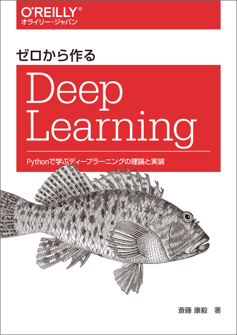

# ゼロから作るDeep Learning ― Pythonで学ぶディープラーニングの理論と実装

    

    <a href="https://www.oreilly.co.jp/books/9784873117584/" class="text-center">
        ゼロから作るDeep Learning ― Pythonで学ぶディープラーニングの理論と実装
    </a>

## この本を読んだきっかけ
「神戸データサイエンス操練所」プログラムの一つで、この本を10人くらいで輪読するものがあった。深層学習を理解する+Pythonでゼロから実装するというコンセプトが合っていて選ばれた。